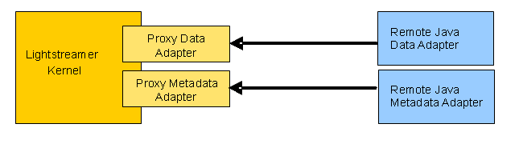

# Lightstreamer - Stock-List Demo - Java Remote Adapter

The Stock-List demos simulate a market data feed and front-end for stock quotes. They show a list of stock symbols and updates prices and other fields displayed on the page in real-time.

This project contains the source code and all the resources needed to install a remote version of the Java Stock-List Demo Data Adapter.

As example of [Clients Using This Adapter](https://github.com/Lightstreamer?utf8=%E2%9C%93&q=lightstreamer-example-stocklist-client&type=&language=), you may refer to the [Lightstreamer - Basic Stock-List Demo - HTML Client](https://github.com/Lightstreamer/Lightstreamer-example-StockList-client-javascript#basic-stock-list-demo---html-client) and view the corresponding [Live Demo](http://demos.lightstreamer.com/StockListDemo_Basic).

## Details

This project includes the implementation of the remote versions of the DataProvider interface for the *Stock-List Demo*.
The Metadata Adapter functionalities are absolved by the `LiteralBasedProvider`, a simple Remote Metadata Adapter already included in the Remote Java Adapters SDK binaries, which is enough for all demo clients.
See also [Lightstreamer - Reusable Metadata Adapters - Remote Java Adapter](https://github.com/Lightstreamer/Lightstreamer-example-ReusableMetadata-adapter-java-remote).

* `StockQuotesDataAdapter.java` is a porting of the class with the same name from the [Lightstreamer - Stock-List Demo - Java Adapter](https://github.com/Lightstreamer/Lightstreamer-example-StockList-adapter-java). 
It implements the *DataProvider* interface and calls back Lightstreamer through the *ItemEventListener* interface. Use it as a starting point to implement your custom data adapter.
It also implements the custom `ExternalFeedListener` interface to receive updates from the `ExternalFeedSimulator` instance (see next point)
* `ExternalFeedSimulator.java` is the same exact class from the [Lightstreamer - Stock-List Demo - Java Adapter](https://github.com/Lightstreamer/Lightstreamer-example-StockList-adapter-java). It randomly generates the
stock quotes used by the demo.
* `ServerMain.java` is the main of the Remote Server application. It instantiates a DataProviderServer and a MetadataProviderServer and launches them using the `ServerStarter` class.

Check out the sources for further explanations.



## Install

If you want to install a version of this demo in your local Lightstreamer server, follow these steps:
* Download the [latest Lightstreamer distribution](http://www.lightstreamer.com/download/) (Lightstreamer Server comes with a free non-expiring demo license for 20 connected users) from [Lightstreamer Download page](http://www.lightstreamer.com/download.htm), and install it, as explained in the `GETTING_STARTED.TXT` file in the installation home directory.
* Get the `deploy.zip` file of the [latest release](https://github.com/Lightstreamer/Lightstreamer-example-StockList-adapter-java-remote/releases) and unzip it.
    * Plug the Proxy Data Adapter and the Proxy MetaData Adapter into the Server: go to the `Deployment_LS` folder and copy the `RemoteStockList` directory and all of its files to the `adapters` folder of your Lightstreamer Server installation.
    * Alternatively, you may plug the **robust** versions of the Proxy Data Adapter and the Proxy MetaData Adapter: go to the `Deployment_LS(robust)` folder and copy the `RemoteStockList` directory and all of its files into `adapters`. This Adapter Set demonstrates the provided "robust" versions of the standard Proxy Data and Metadata Adapters. The robust Proxy Data Adapter can handle the case in which a Remote Data Adapter is missing or fails, by suspending the data flow and trying to connect to a new Remote Data Adapter instance. The robust Proxy Metadata Adapter can handle the case in which a Remote Metadata Adapter is missing or fails, by temporarily denying all client requests and trying to connect to a new Remote Data Adapter instance. See the comments embedded in the generic `adapters.xml` file template, `DOCS-SDKs/adapter_remoting_infrastructure/doc/adapter_robust_conf_template/adapters.xml`, for details. Note that this extended Adapter Set also requires that the client is able to manage the case of missing data. Currently, only the [Lightstreamer - Stock-List Demo - HTML Client](https://github.com/Lightstreamer/Lightstreamer-example-StockList-client-javascript#stocklist-demo) and the [Lightstreamer - Framed Stock-List Demo - HTML Client](https://github.com/Lightstreamer/Lightstreamer-example-StockList-client-javascript#framed-stocklist-demo) front-ends have such ability.
    * Open a command line to the `Deployment_Java_Server` folder and launch the Java Remote Server by issuing the following command
      `java -cp ".\example-StockList-adapter-java-remote-0.0.1-SNAPSHOT.jar;.\dependency\*" com.lightstreamer.example_StockList_adapter_java_remote.server.ServerMain -host localhost -metadata_rrport 6663 -data_rrport 6661 -data_notifport 6662`
* Launch Lightstreamer Server. The Server startup will complete only after a successful connection between the Proxy Adapters and the Remote Adapters.
* Test the Adapter, launching one of the [compatible clients](https://github.com/Lightstreamer?utf8=%E2%9C%93&q=lightstreamer-example-stocklist-client&type=&language=).
    * To make the Stock-List Demo applications, use the newly installed Adapter Set, you need to modify the code
to change the required Adapter Set name from DEMO to STOCKLISTDEMO_REMOTE. Depending on the client library in use, the code might vary (e.g., in JavaScript `new LightstreamerClient(hostToUse,"DEMO");` has to be replaced by `new LightstreamerClient(hostToUse, "STOCKLISTDEMO_REMOTE");`). 
(You don't need to reconfigure the Data Adapter name, as it is the same in both Adapter Sets).
    * In case the JavaScript client is used, you might need to disable the connection sharing to avoid adapter sets conflicts (e.g., by removing or modifiyng `sharingClient.connectionSharing.enableSharing("DemoCommonConnection","ls/","SHARE_SESSION", true);`)
You can now launch the demo that will be fed by the remote adapter.

Please note that the Remote Java Adapter Server connects to the Proxy Adapters, not vice versa.

### Available improvements

#### Add Encryption

Each TCP connection from a Remote Adapter can be encrypted via TLS. To have the Proxy Adapters accept only TLS connections, a suitable configuration should be added in adapters.xml in the <data_provider> block, like this:
```xml
  <data_provider>
    ...
    <param name="tls">Y</param>
    <param name="tls.keystore.type">JKS</param>
    <param name="tls.keystore.keystore_file">./myserver.keystore</param>
    <param name="tls.keystore.keystore_password.type">text</param>
    <param name="tls.keystore.keystore_password">xxxxxxxxxx</param>
    ...
  </data_provider>
```
and the same should be added in the <metadata_provider> block.

This requires that a suitable keystore with a valid certificate is provided. See the configuration details in `DOCS-SDKs/adapter_remoting_infrastructure/doc/adapter_robust_conf_template/adapters.xml`.
NOTE: For your experiments, you can configure the adapters.xml to use the same JKS keystore "myserver.keystore" provided out of the box in the Lightstreamer distribution. Since this keystore contains an invalid certificate, remember to configure your local environment to "trust" it.
The sample Remote Server provided in the `Deployment_DotNet_Adapters` directory in `deploy.zip` is already predisposed for TLS connection on all ports. You can rerun the demo with the new configuration by launching the Java Remote Server with a command like this:
  `java -cp ".\example-StockList-adapter-java-remote-0.0.1-SNAPSHOT.jar;.\dependency\*" com.lightstreamer.example_StockList_adapter_java_remote.server.ServerMain -host xxxxxxxx -tls -metadata_rrport 6663 -data_rrport 6661 -data_notifport 6662`
where the same hostname supported by the provided certificate must be supplied.

#### Add Authentication

Each TCP connection from a Remote Adapter can be subject to Remote Adapter authentication through the submission of user/password credentials. To enforce credential check on the Proxy Adapters, a suitable configuration should be added in adapters.xml in the <data_provider> block, like this:
```xml
  <data_provider>
    ...
    <param name="auth">Y</param>
    <param name="auth.credentials.1.user">user1</param>
    <param name="auth.credentials.1.password">pwd1</param>
    ...
  </data_provider>
```
and the same should be added in the <metadata_provider> block.

See the configuration details in `DOCS-SDKs/adapter_remoting_infrastructure/doc/adapter_robust_conf_template/adapters.xml`.
The sample Remote Server provided in the `Deployment_DotNet_Adapters` directory in `deploy.zip` is already predisposed for credential submission on both adapters. You can rerun the demo with the new configuration by launching the Java Remote Server with a command like this:
  `java -cp ".\example-StockList-adapter-java-remote-0.0.1-SNAPSHOT.jar;.\dependency\*" com.lightstreamer.example_StockList_adapter_java_remote.server.ServerMain -host localhost -user user1 -password pwd1 -metadata_rrport 6663 -data_rrport 6661 -data_notifport 6662`

Authentication can (and should) be combined with TLS encryption.

## Build

To build your own version of tis demo, instead of using the one provided in the deploy.zip file from the Install section above, you have two options:
either use [Maven](https://maven.apache.org/) (or other build tools) to take care of dependencies and building (recommended) or gather the necessary jars yourself and build it manually.
For the sake of simplicity only the Maven case is detailed here.

### Maven

You can easily build and run this application using Maven through the pom.xml file located in the root folder of this project. As an alternative, you can use an alternative build tool (e.g. Gradle, Ivy, etc.) by converting the provided pom.xml file.

Assuming Maven is installed and available in your path you can build the demo by running
```sh
 mvn package
```

You can also run the application with the following command
```sh
 mvn exec:java -Dexec.args="-host localhost -metadata_rrport 6663 -data_rrport 6661 -data_notifport 6662"
```

## See Also
* [Adapter Remoting Infrastructure Network Protocol Specification](http://www.lightstreamer.com/docs/adapter_generic_base/ARI%20Protocol.pdf)

### Related Projects
* [Lightstreamer - Reusable Metadata Adapters - Java Adapter](https://github.com/Lightstreamer/Lightstreamer-example-ReusableMetadata-adapter-java)
* [Lightstreamer - Stock-List Demo - Java Adapter](https://github.com/Lightstreamer/Lightstreamer-example-StockList-adapter-java)

## Lightstreamer Compatibility Notes

- Compatible with Lightstreamer SDK for Java Remote Adapters version 1.4 or newer
- For a version of this example compatible with SDK for Java Remote Adapters 1.3 please refer to [this tag](https://github.com/Lightstreamer/Lightstreamer-example-StockList-adapter-java-remote/tree/for_release_1.3)
- For a version of this example compatible with SDK for Java Remote Adapters 1.1 to 1.2 please refer to [this tag](https://github.com/Lightstreamer/Lightstreamer-example-StockList-adapter-java-remote/tree/for_Lightstreamer_7.0).
