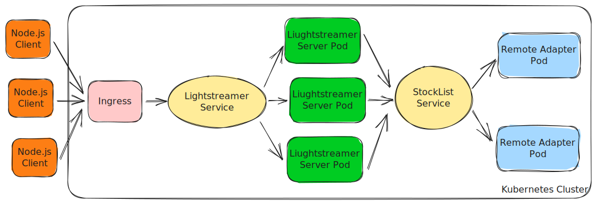

# Lightstreamer - Stock-List Cluster  Demo - Java Remote Adapter

The Stock-List Cluster demo is a specialised version of the [Lightstreamer - Stock-List Demo - Java Remote Adapter](https://github.com/Lightstreamer/Lightstreamer-example-StockList-adapter-java-remote), where the connection inversion options is shown.

As example of [Clients Using This Adapter](https://github.com/Lightstreamer?utf8=%E2%9C%93&q=lightstreamer-example-stocklist-client&type=&language=), you may refer to the [Lightstreamer - Basic Stock-List Demo - HTML Client](https://github.com/Lightstreamer/Lightstreamer-example-StockList-client-javascript#basic-stock-list-demo---html-client) and view the corresponding [Live Demo](http://demos.lightstreamer.com/StockListDemo_Basic).

## Details

Normally, with Remote Lightstreamer Adapters, the Lightstreamer Server opens listening TCP ports to which the Remote Adapters connect.


However, there exist cases where it would be more flexible to invert the connections and allow the Lightstreamer Server to connect to the  Remote Adapters. By doing this, it is possible to have a single Remote Adapter serving multiple Lightstreamer Servers.


By eliminating the need to predefine the number of Lightstreamer instances and their addresses in advance, this new approach enables a single Remote Server to handle connections from all the Ligitstreamer servers in a cluster. The Remote Adapter will simply need to spawn new `DataProviderSever` and `MetadataProviderServer` for each new incoming connection.

Moreover, it is also be possible to set up a cluster of Remote Adapters behind a load balancer. This way, the Lightstreamer Server cluster and the Remote Adapter clusters can scale independently in a fully elastic way.


Following are the main differences with the original projects:
1. [`ServerMain.java`](src/main/java/com/lightstreamer/example_StockList_adapter_java_remote/server/ServerMain.java) and [`ServerStarter.java`](src/main/java/com/lightstreamer/example_StockList_adapter_java_remote/server/ServerStarter.java) have been modified to accept multiple connections and associate to them new instances of `DataProviderServer` and a `MetadataProvider`.

2. [`StockQuotesAdapter.java`](src/main/java/com/lightstreamer/example_StockList_adapter_java_remote/server/ServerMain.java) has been updated as well in order to share a single instance of [`ExternalFeedSimulator`](src/main/java/com/lightstreamer/example_StockList_adapter_java_remote/feed_simulator/ExternalFeedSimulator.java), which nows is responsible to push updates to multiple instances of the adapter.

Check out the sources for further explanations.


## Deploy to Lightweight Kubernetes Distribution

In this section, we show how to deploy the following architecture to [k3d](https://k3d.io/), a lightweight Kubernetes distribution which is very easy to configure and use



This example can be used as a minimal starting point to set up a production-ready deployment for a more complex infrastructure hosted by a major cloud provider (AWS, GCP, Azure, etc.).

### Overview

The `k8s` folder holds the all of the manifests needed to create the resources of the demo cluster:

- [`stocklist-deployment.yaml`](k8s/stocklist-deployment.yaml), the StockList Remote Adapter deployment, which is made of two replicas. In particular, pay attention to the following setting:

   ```yaml
   image: ls-cluster-registry:5000/stocklist-remote-adapter
   ```

   where the image will be feteched from a local Docker registry. While tipically not necessary in a production deployment, this greatly simplifies the setup of a locally running k8s cluster, as you won't have to pre-publish a Docker image to a remote registry.

- [`stocklist-service.yaml`](k8s/stocklist-service.yaml), the service to expose the StockList Remote Adapter deployment to the Lightstreamer pods.

- [`lightstreamer-deployment.yaml`](k8s/lightstreamer-deployment.yaml), the Lightstreamer deployment, which is made of three replicas.

- [`lightstreamer-service.yaml`](k8s/lightstreamer-service.yaml), the service to expose the Lightstreamer deployment.

- [`adapters.xml`](k8s/adapters.xml), the _Adapter Set_ configuration file, which will be provided as a config map mounted to every pod of the Lightstreamer deployment.

  Since the Proxy Adapters will connect to the Remote Java Adapter Server, not vice-versa, the following specific configuration is added in the `<data_provider>` and `<metadata_provider>` blocks:

  ```xml
   <param name="remote_host">stocklist.lightstreamer-dev.svc.cluster.local</param>
  ```

  where `stocklist.lightstreamer-dev.svc.cluster.local` is the internal DNS name assigned to the StockList service defined in `stocklist-service.yaml`.

- [`lightsteamer-ingress.yaml`](k8s/lightstreamer-ingress.yaml), the ingress to manange external access to the Lightstreamer service.

- [`namespace.yaml`](k8s/namespace.yaml), the definition of the `lightstreamer-dev` namespace.

- [`kustomization.yaml`](k8s/kustomization.yaml), the _kustomization_ file, which is used to apply all the above resources.

### Requirements

You need the following software installed on your machine:

- [docker](https://www.docker.com/)
- [kubectl](https://kubernetes.io/docs/tasks/tools/#kubectl)
- [k3d](https://k3d.io)

### Create the Kubernetes Cluster

Create a cluster named `ls-cluster` and add the flags to:

1. Set up a local Docker registry to publish the image of the StockList Remote Adapter.
2. Make the Lightstreamer service accessible through `localhost:8080` via the ingress defined in `lightsteamer-ingress.yaml` (see [here](https://k3d.io/v5.5.2/usage/exposing_services/) for more information).

```sh
k3d cluster create ls-cluster --registry-create ls-cluster-registry:0.0.0.0:5000 -p "8080:80@loadbalancer"
```

Verify the cluster with:

```sh
kubectl cluster-info

Kubernetes control plane is running at https://0.0.0.0:46353
CoreDNS is running at https://0.0.0.0:46353/api/v1/namespaces/kube-system/services/kube-dns:dns/proxy
Metrics-server is running at https://0.0.0.0:46353/api/v1/namespaces/kube-system/services/https:metrics-server:https/proxy
```

## Build and Publish the Docker Image.

From the project root, build the Docker image of the StockList Remote Adapter.

```sh
docker build . -t stocklist-remote-adapter
```

In order to keep the size of the image small, the Dockerfile has ben structured to leverage the _multistage-builds_ feature: a Maven-based image builds the jar file, which will be then copied to the final java-based image.

Perform the following commands to publish the Docker image to the local registry:

```sh
docker tag stocklist-remote-adapter localhost:5000/stocklist-remote-adapter
docker push localhost:5000/stocklist-remote-adapter
```

Verify the images with:

```sh
docker image ls

REPOSITORY                                TAG            IMAGE ID       CREATED        SIZE
stocklist-remote-adapter                  latest         64ab7867e2b8   18 hours ago   390MB
localhost:5000/stocklist-remote-adapter   latest         64ab7867e2b8   18 hours ago   390MB
...
```

### Create the Resources

Move to the `k8s` folder and run:

```sh
kubectl apply -k .

namespace/lightstreamer-dev created
configmap/adapters-685574d454 created
service/lightstreamer created
service/stocklist created
deployment.apps/lightstreamer-deployment created
deployment.apps/stocklist-deployment created
ingress.networking.k8s.io/lightstreamer-ingress created
```

Verify the status of the deployments:

```sh
kubectl get deploy -n lightstreamer-dev

NAME                       READY   UP-TO-DATE   AVAILABLE   AGE
stocklist-deployment       2/2     2            2           5m2s
lightstreamer-deployment   3/3     3            3           7m2s
```

Verify the status of the services:

```sh
kubectl get service -n lightstreamer-dev

NAME            TYPE        CLUSTER-IP     EXTERNAL-IP   PORT(S)             AGE
lightstreamer   ClusterIP   10.43.29.108   <none>        8080/TCP            1m49s
stocklist       ClusterIP   10.43.19.73    <none>        6663/TCP,6661/TCP   2m28s
```

### Connect to the Cluster

To verify that the cluster has been properly deployed, let's use the [Lightstreamer - Basic Stock-List Demo - Node.js Client](https://github.com/Lightstreamer/Lightstreamer-example-StockList-client-node) client, which is already configured to connect to a Lightstreamer server listening on `localhost:8080`.

1. Make sure that `nodejs` and `npm` are installed in your local machine.

2. Clone the project:

   ```sh
   https://github.com/Lightstreamer/Lightstreamer-example-StockList-client-node.git
   ```

3. Move to the project folder and install the client with:

   ```sh
   npm install
   ```

4. Run the client:

   ```sh
   node src/index.js
   ```

Finally, verify that the updates flow as expected:

```sh
Ations Europe: 15.94
Anduct: 3.0
Bagies Consulting: 6.96
Ations Europe: 17.1
Bagies Consulting: 6.97
Bagies Consulting: 7.29
Ations Europe: 15.97
Ations Europe: 17.06
Ations Europe: 16.13
Ations Europe: 16.96
Ations Europe: 16.13
Ations Europe: 16.8
Ations Europe: 16.29
Ations Europe: 16.71
Ations Europe: 16.66
Bagies Consulting: 6.97
Ations Europe: 16.4
...
```

### Clean Up

Run the following to clean up all the Kubernetes and Docker resources:

1. Delete the k3d cluster:
   
   ```sh
   k3d cluster delete ls-cluster
   ```
   
2. Delete the local Docker registry:

   ```sh
   docker rmi registry:2
   ```

3. Delete the StockList Remote Adapter Docker image:

   ```sh
   docker rmi localhost:5000/stocklist-remote-adapter
   docker rmi stocklist-remote-adapter
   ```


## See Also
* [Adapter Remoting Infrastructure Network Protocol Specification](https://lightstreamer.com/api/ls-generic-adapter/latest/ARI%20Protocol.pdf)

### Related Projects
* [Lightstreamer Java Remote Adapter SDK](https://github.com/Lightstreamer/Lightstreamer-lib-adapter-java-remote)
* [LiteralBasedProvider Metadata Adapter](https://github.com/Lightstreamer/Lightstreamer-lib-adapter-java-remote#literalbasedprovider-metadata-adapter)
* [Lightstreamer - Stock-List Demo - Java Adapter](https://github.com/Lightstreamer/Lightstreamer-example-StockList-adapter-java)

## Lightstreamer Compatibility Notes

* Compatible with Lightstreamer SDK for Java Remote Adapters version 1.7 or newer and Lightstreamer Server version 7.4 or newer.
