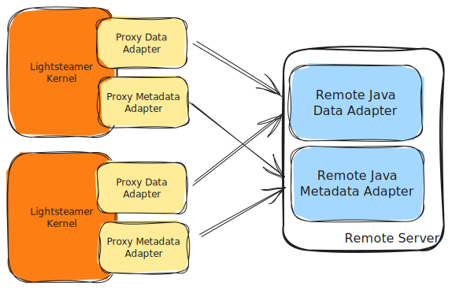

# Lightstreamer - Stock-List Clustered Demo - Java Remote Adapter

The Stock-List Cluster demo is a specialised version of the [Lightstreamer - Stock-List Demo - Java Remote Adapter](https://github.com/Lightstreamer/Lightstreamer-example-StockList-adapter-java-remote), where the connection inversion options is shown.

As example of [Clients Using This Adapter](https://github.com/Lightstreamer?utf8=%E2%9C%93&q=lightstreamer-example-stocklist-client&type=&language=), you may refer to the [Lightstreamer - Basic Stock-List Demo - HTML Client](https://github.com/Lightstreamer/Lightstreamer-example-StockList-client-javascript#basic-stock-list-demo---html-client) and view the corresponding [Live Demo](http://demos.lightstreamer.com/StockListDemo_Basic).

## Details

Ad depicted in the architecture diagram below, in this project the Remote Server opens a listening TCP port and Proxy Adapters connects to it.



This new approach enables a single Remote Server to handle connections from all Ligitstreamer servers, eliminating the need to predefine the number of Lightstreamer instances and their addresses in advance. The Remote Server will simple need to spawn new `DataProviderSever` and `MetadataProviderServer` for each new incoming connection.

Moreover, it would also possible to setup a cluster of remote adapters behind a load balancer. This way, the two clusters can scale independently, allowing great flexibility and resources optimization.


Following are the main differences with the original projects:
1. [`ServerMain.java`](src/main/java/com/lightstreamer/example_StockList_adapter_java_remote/server/ServerMain.java) and [`ServerStarter.java`](src/main/java/com/lightstreamer/example_StockList_adapter_java_remote/server/ServerStarter.java) have been modified to accept multiple connections and associate to them new instances of `DataProviderServer` and a `MetadataProvider`.

2. [`StockQuotesAdapter.java`](src/main/java/com/lightstreamer/example_StockList_adapter_java_remote/server/ServerMain.java) has been updated as well in order to share a single instance of [`ExternalFeedSimulator`](src/main/java/com/lightstreamer/example_StockList_adapter_java_remote/feed_simulator/ExternalFeedSimulator.java), which nows is responsible to push updates to multiple instances of the adapter.

Check out the sources for further explanations.


## Install

As said, the Proxy Adapters will connect to the Remote Java Adapter Server, not vice-versa.
This Requires a specific configuration on Lightstreamer Server in adapters.xml, where
```xml
    <param name="remote_host">localhost</param>
```
is added in the <data_provider> or <metadata_provider> block corresponding to each Proxy Adapter.

If you want to install a version of this demo in your local Lightstreamer server, follow these steps:
* Download the [latest Lightstreamer distribution](http://www.lightstreamer.com/download/) (Lightstreamer Server comes with a free non-expiring demo license for 20 connected users) from [Lightstreamer Download page](http://www.lightstreamer.com/download.htm), and install it, as explained in the `GETTING_STARTED.TXT` file in the installation home directory.
* Get the `deploy_inverted.zip` file of the [latest release](https://github.com/Lightstreamer/Lightstreamer-example-StockList-adapter-java-remote/releases) and unzip it.
    * Plug the Proxy Data Adapter and the Proxy MetaData Adapter into the Server: go to the `Deployment_LS` folder and copy the `RemoteStockList` directory and all of its files to the `adapters` folder of your Lightstreamer Server installation.
    * Alternatively, you may plug the **robust** versions of the Proxy Data Adapter and the Proxy MetaData Adapter: go to the `Deployment_LS(robust)` folder and copy the `RemoteStockList` directory and all of its files into `adapters`. This Adapter Set demonstrates the provided "robust" versions of the standard Proxy Data and Metadata Adapters. The robust Proxy Data Adapter can handle the case in which a Remote Data Adapter is missing or fails, by suspending the data flow and trying to connect to a new Remote Data Adapter instance. The robust Proxy Metadata Adapter can handle the case in which a Remote Metadata Adapter is missing or fails, by temporarily denying all client requests and trying to connect to a new Remote Data Adapter instance. See the comments embedded in the provided [`adapters.xml` file template](https://lightstreamer.com/docs/ls-server/latest/remote_adapter_robust_conf_template/adapters.xml), for details. Note that this extended Adapter Set also requires that the client is able to manage the case of missing data. Currently, only the [Lightstreamer - Stock-List Demo - HTML Client](https://github.com/Lightstreamer/Lightstreamer-example-StockList-client-javascript#stocklist-demo) and the [Lightstreamer - Framed Stock-List Demo - HTML Client](https://github.com/Lightstreamer/Lightstreamer-example-StockList-client-javascript#framed-stocklist-demo) front-ends have such ability.
    * Open a command line to the `Deployment_Java_Server` folder and launch the Java Remote Server through the proper `start_adapter` script or (in Windows) by issuing the following command:
      ```sh
          java -cp "./example-StockList-adapter-java-remote-0.1.0-SNAPSHOT.jar;./dependency/*" ^
              com.lightstreamer.example_StockList_adapter_java_remote.server.ServerMain ^
              -metadata_rrport 6663 -data_rrport 6661
      ```
* Launch Lightstreamer Server. The Server startup will complete only after a successful connection between the Proxy Adapters and the Remote Adapters.
* Test the Adapter, launching one of the [compatible clients](https://github.com/Lightstreamer?utf8=%E2%9C%93&q=lightstreamer-example-stocklist-client&type=&language=).
    * To make the Stock-List Demo applications, use the newly installed Adapter Set, you need to modify the code to change the required Adapter Set name from DEMO to STOCKLISTDEMO_REMOTE. Depending on the client library in use, the code might vary (e.g., in JavaScript `new LightstreamerClient(hostToUse,"DEMO");` has to be replaced by `new LightstreamerClient(hostToUse, "STOCKLISTDEMO_REMOTE");`). (You don't need to reconfigure the Data Adapter name, as it is the same in both Adapter Sets).
    * In case the JavaScript client is used, you might need to disable the connection sharing to avoid adapter sets conflicts (e.g., by removing or modifiyng `sharingClient.connectionSharing.enableSharing("DemoCommonConnection","ls/","SHARE_SESSION", true);`)
You can now launch the demo that will be fed by the remote adapter.

### Available improvements

#### Add Encryption

Each TCP connection from a Proxy Adapter can be encrypted via TLS. To have the Remote Server accept only TLS connections, a suitable keystore with a valid certificate should be provided to the Remote Server.
The sample code in the `ServerStarter` class supports this case by leaning on the JDK implementation, hence keystore information can be provided on the command line through the JSSE system properties `javax.net.ssl.keyStore` and `javax.net.ssl.keyStorePassword`.
The sample Remote Server provided in the `Deployment_Java_Server` directory in `deploy_inverted.zip` is already predisposed for TLS connection on all ports. You can rerun the demo with the new configuration by launching the Java Remote Server with a command like this:
```sh
    java -cp "./example-StockList-adapter-java-remote-0.1.0-SNAPSHOT.jar;./dependency/*" ^
        -Djavax.net.ssl.keyStore=<path-to-keystore> -Djavax.net.ssl.keyStorePassword=<keystore-password> ^
        com.lightstreamer.example_StockList_adapter_java_remote.server.ServerMain ^
        -tls -metadata_rrport 6663 -data_rrport 6661
```

A corresponding configuration is needed on Lightstreamer Server in adapters.xml. Just add
```xml
    <param name="tls">Y</param>
```
in both the <data_provider> and <metadata_provider> block and ensure that the name in the `remote_host` parameter corresponds to the name on the certificate.

NOTE: For your experiments, you can specify to the Remote Server to use the same JKS keystore "myserver.keystore" provided out of the box in the Lightstreamer distribution.
Since this keystore contains an invalid certificate, the Proxy Adapter should be configured to "trust" it and to omit certificate hostname verification.
This can be done by adding suitable parameters in adapters.xml in the <data_provider> and <metadata_provider> block, like this:
```xml
    <param name="tls.truststore.type">JKS</param>
    <param name="tls.truststore.truststore_file">path-to-myserver.keystore</param>
    <param name="tls.truststore.truststore_password.type">file</param>
    <param name="tls.truststore.truststore_password">path-to-myserver.keypass</param>
    <param name="tls.skip_hostname_check">Y</param>
```
See the configuration details in the [provided template](https://lightstreamer.com/docs/ls-server/latest/remote_adapter_robust_conf_template/adapters.xml).

#### Add Authentication

The Proxy Adapter can authenticate the Remote Server through user/password credentials in the same way shown for the normal connection policy.
However, with the connection inversion policy, the TLS certificate check performed by the Proxy Adapter upon connection can also be used to authenticate the Remote Server.
On the other hand, to allow the Remote Server authenticate a Proxy Adapter which connects to it, no user/password credential check is available.
The only option is for the Remote Server to require that the Proxy Adapter issues a trusted client-side TLS certificate. The needed certificate can be configured on the Proxy Adapter by leveraging the `tls.keystore.*` settings.

Actually, when the inversion policy is leveraged, it is assumed a scenario in which LS Server and the Remote Server both stay inside the back-end.
If LS Server stays in a DMZ (not to mention the outer Internet), which implies allowing on the back-end incoming connections from the DMZ, the inversion policy is not recommended;
rather, we recommend the normal connection policy, where only outgoing connections from the back-end to the DMZ have to be enabled.

## Build

To build your own version of this demo, instead of using the one provided in the deploy.zip file from the Install section above, you have two options:
either use [Maven](https://maven.apache.org/) (or other build tools) to take care of dependencies and building (recommended) or gather the necessary jars yourself and build it manually.
For the sake of simplicity only the Maven case is detailed here.

### Maven

You can easily build and run this application using Maven through the pom.xml file located in the root folder of this project. As an alternative, you can use an alternative build tool (e.g. Gradle, Ivy, etc.) by converting the provided pom.xml file.

Assuming Maven is installed and available in your path you can build the demo by running
```sh
 mvn package
```

You can also run the application with the following command
```sh
 mvn exec:java -Dexec.args="-metadata_rrport 6663 -data_rrport 6661"
```

## See Also
* [Adapter Remoting Infrastructure Network Protocol Specification](https://lightstreamer.com/api/ls-generic-adapter/latest/ARI%20Protocol.pdf)

### Related Projects
* [Lightstreamer Java Remote Adapter SDK](https://github.com/Lightstreamer/Lightstreamer-lib-adapter-java-remote)
* [LiteralBasedProvider Metadata Adapter](https://github.com/Lightstreamer/Lightstreamer-lib-adapter-java-remote#literalbasedprovider-metadata-adapter)
* [Lightstreamer - Stock-List Demo - Java Adapter](https://github.com/Lightstreamer/Lightstreamer-example-StockList-adapter-java)

## Lightstreamer Compatibility Notes

* Compatible with Lightstreamer SDK for Java Remote Adapters version 1.7 or newer and Lightstreamer Server version 7.4 or newer.
- For a version of this example compatible with Lightstreamer Server version since 7.0, please refer to [this tag](https://github.com/Lightstreamer/Lightstreamer-example-StockList-adapter-java-remote/tree/for_Lightstreamer_7.3).
- For a version of this example compatible with SDK for Java Remote Adapters 1.4 to 1.6, please refer to [this tag](https://github.com/Lightstreamer/Lightstreamer-example-StockList-adapter-java-remote/tree/for_Lightstreamer_7.3).
- For a version of this example compatible with SDK for Java Remote Adapters 1.3 please refer to [this tag](https://github.com/Lightstreamer/Lightstreamer-example-StockList-adapter-java-remote/tree/for_release_1.3).
- For a version of this example compatible with SDK for Java Remote Adapters 1.1 to 1.2 please refer to [this tag](https://github.com/Lightstreamer/Lightstreamer-example-StockList-adapter-java-remote/tree/for_Lightstreamer_7.0).
